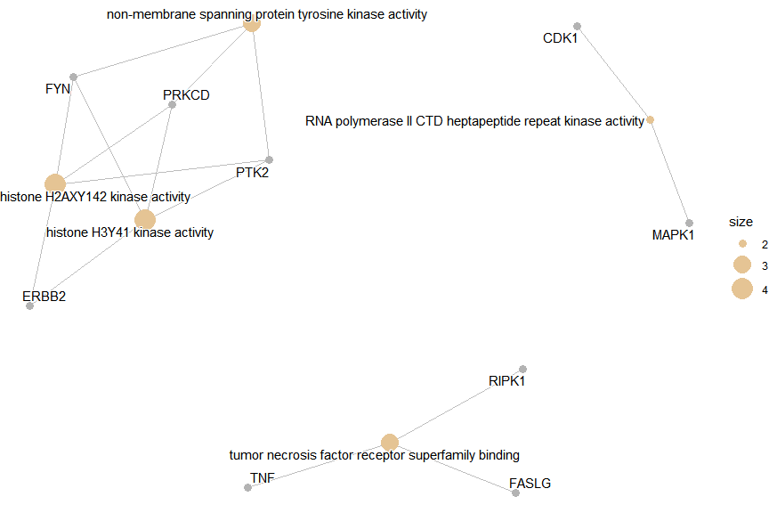

# TCMDATA

## Search for the target genes of the selected herbs

``` r
library(TCMDATA)
herbs <- c("灵芝")
lz <- search_herb(herb = herbs, type = "Herb_cn_name")
head(lz)
```

    ##      herb                  molecule target
    ## 1 lingzhi 3,4-Dihydroxybenzoic acid    GAA
    ## 2 lingzhi 3,4-Dihydroxybenzoic acid   POLB
    ## 3 lingzhi 3,4-Dihydroxybenzoic acid    APP
    ## 4 lingzhi 3,4-Dihydroxybenzoic acid    CA1
    ## 5 lingzhi 3,4-Dihydroxybenzoic acid   CA12
    ## 6 lingzhi 3,4-Dihydroxybenzoic acid   CA14

## Search for herbs that target specific genes

``` r
genes <- c("TP53", "EGFR", "BRCA1")
herbs <- search_target(genes)
head(herbs)
```

    ##            herb        molecule target
    ## 1        fengmi     Formic Acid   TP53
    ## 2 jiuxiangchong 1,2-Benzenediol   EGFR
    ## 3      fengfang     Gallic Acid   EGFR
    ## 4      fengfang     Gallic Acid   TP53
    ## 5        fengmi     Gallic Acid   EGFR
    ## 6        fengmi     Gallic Acid   TP53

## Functional enrichment of target genes

``` r
# You may obtain your genes of interest by `intersect(lz$target, DE_genes)`
set.seed(2025)
g <- sample(lz$target, 200)
library(clusterProfiler)
x <- enrichGO(g, ont="MF", OrgDb='org.Hs.eg.db', keyType="SYMBOL")
```

    ## 

``` r
head(x)
```

    ##                    ID                                               Description
    ## GO:0004715 GO:0004715    non-membrane spanning protein tyrosine kinase activity
    ## GO:0035401 GO:0035401                             histone H3Y41 kinase activity
    ## GO:0140801 GO:0140801                          histone H2AXY142 kinase activity
    ## GO:0008353 GO:0008353 RNA polymerase II CTD heptapeptide repeat kinase activity
    ## GO:0032813 GO:0032813        tumor necrosis factor receptor superfamily binding
    ## GO:0035173 GO:0035173                                   histone kinase activity
    ##            GeneRatio   BgRatio RichFactor FoldEnrichment    zScore       pvalue
    ## GO:0004715      3/50  45/18639 0.06666667       24.85200  8.308092 0.0002380769
    ## GO:0035401      4/50 115/18639 0.03478261       12.96626  6.675697 0.0002544242
    ## GO:0140801      4/50 115/18639 0.03478261       12.96626  6.675697 0.0002544242
    ## GO:0008353      2/50  10/18639 0.20000000       74.55600 12.066463 0.0003130327
    ## GO:0032813      3/50  50/18639 0.06000000       22.36680  7.846087 0.0003257581
    ## GO:0035173      6/50 360/18639 0.01666667        6.21300  5.179876 0.0003863503
    ##              p.adjust     qvalue                          geneID Count
    ## GO:0004715 0.01938191 0.01497955                  FYN/PTK2/PRKCD     3
    ## GO:0035401 0.01938191 0.01497955            ERBB2/FYN/PTK2/PRKCD     4
    ## GO:0140801 0.01938191 0.01497955            ERBB2/FYN/PTK2/PRKCD     4
    ## GO:0008353 0.01938191 0.01497955                      CDK1/MAPK1     2
    ## GO:0032813 0.01938191 0.01497955                 FASLG/RIPK1/TNF     3
    ## GO:0035173 0.01938191 0.01497955 ERBB2/FYN/CDK1/PTK2/PRKCD/RIPK1     6

### Visualization

``` r
library(enrichplot)
cnetplot(x)
```

<!-- -->
